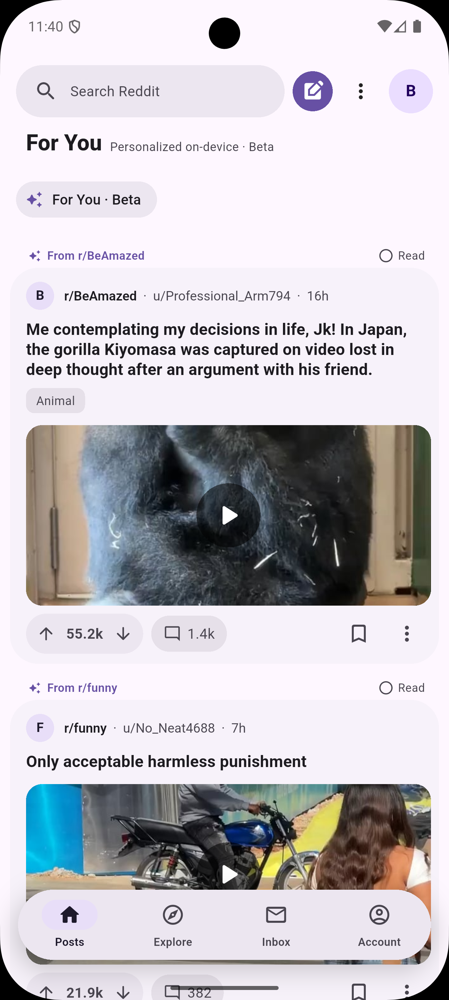
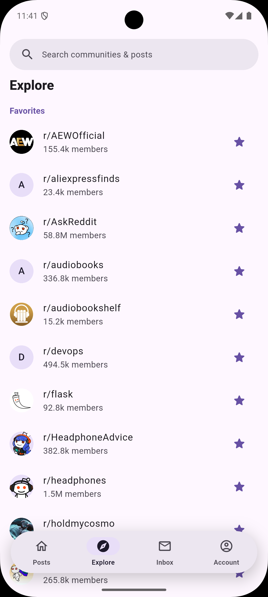
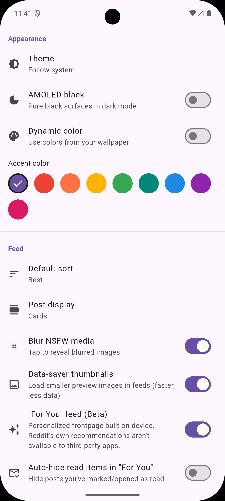

# Luli for Reddit

A fast, modern Reddit client for Android, built with Flutter and a Material 3
Expressive design. You bring your own Reddit API credentials; nothing is sent
anywhere but Reddit.

## Features

- Browse the frontpage, subreddits, multireddits, and users
- A personalized **For You** feed built entirely on-device, with explainable
  "why you're seeing this" labels and per-post tuning
- Full participation: vote, comment, reply, submit text/link/image/gallery/video
  posts, edit, and delete
- Inbox and private messages
- Saved, upvoted, and locally-stored history
- Moderation actions on subreddits you moderate
- Three feed layouts, swipe-to-vote, NSFW blur, AMOLED and dynamic-color themes
- Offline cache, rate-limit awareness, and an in-app updater

## Screenshots

<p>
  
  
  
  
  
</p>

## How the "For You" feed works

Reddit doesn't give third-party apps access to its own recommendation engine, so
Luli builds one on your device. Nothing about your interests ever leaves the
phone.

1. **Candidates.** Luli pulls a pool of posts from the sources that actually
   matter to you: your subscription frontpage, fresh posts from your favourite
   subreddits, the communities you engage with most, what's rising in your
   subscriptions, and a small slice of r/popular for discovery.
2. **On-device learning.** As you use the app it quietly learns which subreddits
   you care about — upvoting, saving, and opening posts nudge that community's
   score up (saving counts most, a passing glance least). This lives only in
   local storage.
3. **Ranking.** Each candidate is scored by *community weight* (favourites ≫
   subscribed ≫ discovery, boosted by what you've learned) combined with the
   post's velocity (score per hour), recency, and upvote ratio. Already-seen
   posts are demoted.
4. **Diversity.** No single subreddit can dominate — posts are capped per
   community, and discovery picks are sprinkled in at roughly 1 in 6 so the feed
   stays mostly *your* communities without becoming repetitive.
5. **Explainable & tunable.** Every post shows why it's there ("★ Favourite",
   "Because you engage with r/…", "Trending"), and a long-press lets you ask for
   more or less of a community, or mute it entirely.

## Install

Download the APK from the
[latest release](https://github.com/bennybar/LuliReddit/releases/latest) and
install it. The app checks GitHub for newer releases and can update itself.

(iOS has no public distribution — build and sideload it yourself; see `ios.txt`.)

## First run

The app ships with no API keys — you provide your own:

1. Go to <https://www.reddit.com/prefs/apps> and create an app of type
   **installed app**.
2. Set the redirect URI to exactly `luli://oauth`.
3. Copy the client ID (shown under the app name) into the login screen and
   connect.

## Build from source

Requires Flutter 3.35+.

```
flutter pub get
dart run build_runner build --delete-conflicting-outputs
flutter build apk --release
```

## Tech

Flutter, Riverpod, Dio, go_router, Freezed. Reddit OAuth2 (installed-app flow),
credentials stored in the device keychain.

Not affiliated with Reddit, Inc.
